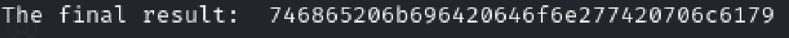

# Fixed XOR
Author: Ngo Van Tai

## Description
Write a function that takes two equal-length buffers and produces their XOR combination.

If your function works properly, then when you feed it the string:

`1c0111001f010100061a024b53535009181c`

... after hex decoding, and when XOR'd against:

`686974207468652062756c6c277320657965`

... should produce:

`746865206b696420646f6e277420706c6179`

## Writeups

First, this is a [XOR operation](https://en.wikipedia.org/wiki/Exclusive_or). 

This challenge provides two hex stirng and ask us to perform XOR combination, the result is hexadecimal type

First, we need to convert these 2 hex strings into raw bytes (use `bytes.fromhex()`)

```python
bytes_1 = bytes.fromhex(hex_string1)
bytes_2 = bytes.fromhex(hex_string2)
```

then we perform XOR combination, we loop through these bytes and use `^` to perform XOR

```python
for i in range(len(bytes_1)):
    bytes_list.append(bytes_1[i] ^ bytes_2[i])
```

Noitice that the `^` operation will return a decimal value, not a raw bytes, so the result of the list after we combime them with XOR will be a list of decimal values, these decimals are the ascii value (0-225) ! run the .py file to see the output


Then we convert it back to raw bytes, by using function `bytes()`

```python
bytes_result = bytes(bytes_list)
```

then we convert it to hex again, using decode(), aslo need to use hexlify().

So, what is [hexlify](https://docs.alchemy.com/reference/hexlify),the  `hexlify` will convert the given value to its hexadecimal representation, it doens't change the type

so if we only use this to convert the result to hex, this is our result
`bytes_result.decode())`


it automatically changed to characters based on ASCII right?

so we need to include `hexlify()`

`hexlify(bytes_result).decode()`

The output:

