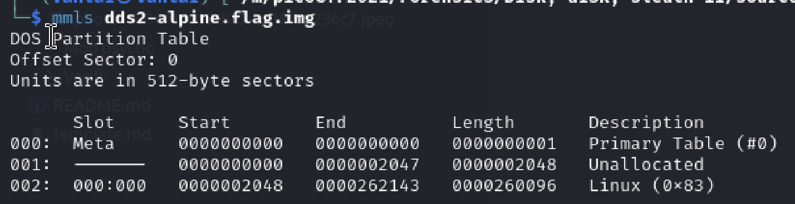
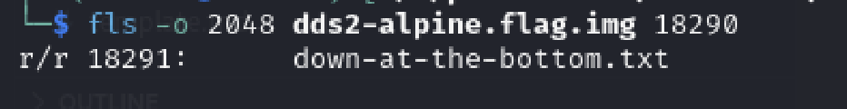
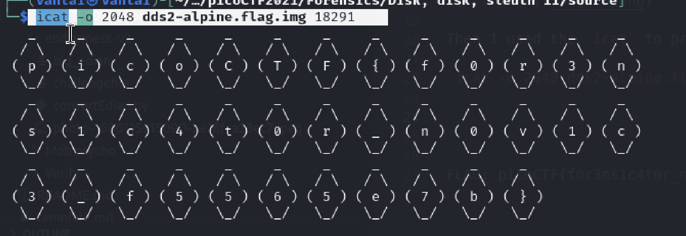

# Disk, disk, sleuth! II
Author: Tai Ngo

## Description
Author: syreal

All we know is the file with the flag is named `down-at-the-bottom.txt`... Disk image: dds2-alpine.flag.img.gz

## Writeups
Firstly, I use `mmls` to explore the img first

it shows that the Linux (0x83) is the biggest file, then I use `fls` to go to that

`fls -o 2048 dds2-alpine.flag.img 18290`

Then I used the `icat` to print this out

`icat -o 2048 dds2-alpine.flag.img 18291`

FLAG: picoCTF{f0r3ns1c4t0r_n0v1c3_f5565e7b}