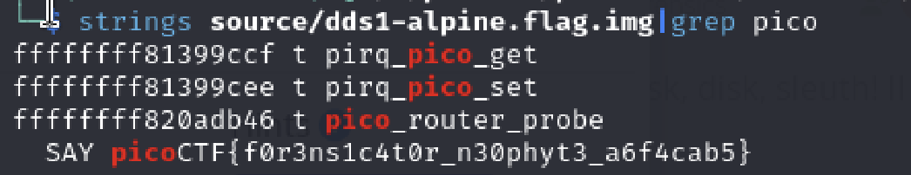

# Disk, disk, sleuth!
Author: Tai Ngo

## Description
Author: syreal

Use `srch_strings` from the sleuthkit and some terminal-fu to find a flag in this disk image: dds1-alpine.flag.img.gz

## Writeups 

After using `mmls` to explore the img, I don't find much, but I just simply `stirngs` it out, it works

