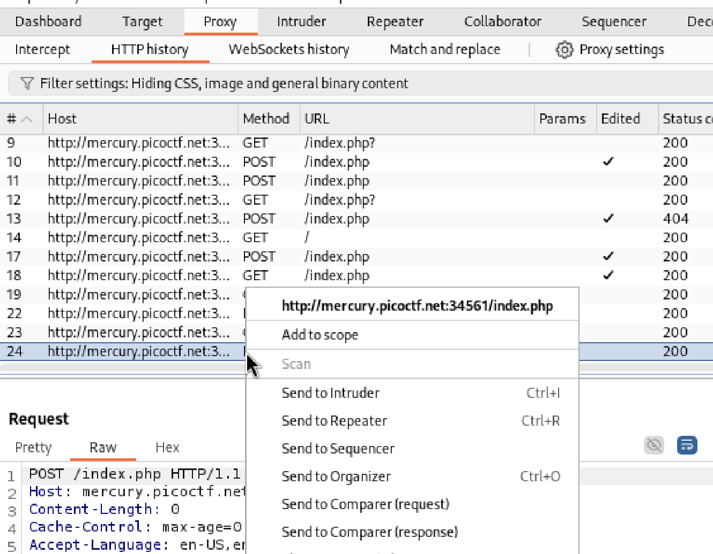

# GET aHEAD
Author: Tai Ngo

## Description

Author: madStacks

Find the flag being held on this server to get ahead of the competition http://mercury.picoctf.net:34561/

## Writeups

In this challenge, I checked on the two buttons, the red one is `GET` method, the blue one is `POST` method. I noiticed to the title of the challenge, it is GET aHEAD, so I used Burp Suite to change the method to `HEAD` instead of `GET` or `POST`. 

Send to repeater, then in the `repeater` tab, modify the request to `HEAD` and send it. 

Flag: picoCTF{r3j3ct_th3_du4l1ty_8f878508}