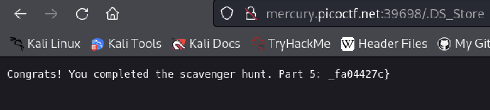

# Scavenger Hunt
Author: Tai Ngo

## Description

Author: madStacks

There is some interesting information hidden around this site http://mercury.picoctf.net:39698/. Can you find it?

## Writeups

In this challenge, I checked the three files html, css and javascript. The HTML and CSS provide me with two pieces of the flag

HTML:

CSS: /* CSS makes the page look nice, and yes, it also has part of the flag. Here's part 2: h4ts_4_l0 */

JS file: /* How can I keep Google from indexing my website? */

The javascript file gives me hint, I tried to search that on Google, and it returns about the robots.txt

It gives another hint about apache server. I searched about the apache server configuration files, and found [this](https://httpd.apache.org/docs/2.4/configuring.html). Then I accessed the `.htaccess` on the website

Then, it is related to the Mac, store information, and I foudn the `.DS_Store` file.

Flag: picoCTF{th4ts_4_l0t_0f_pl4c3s_2_lO0k_fa04427c}

