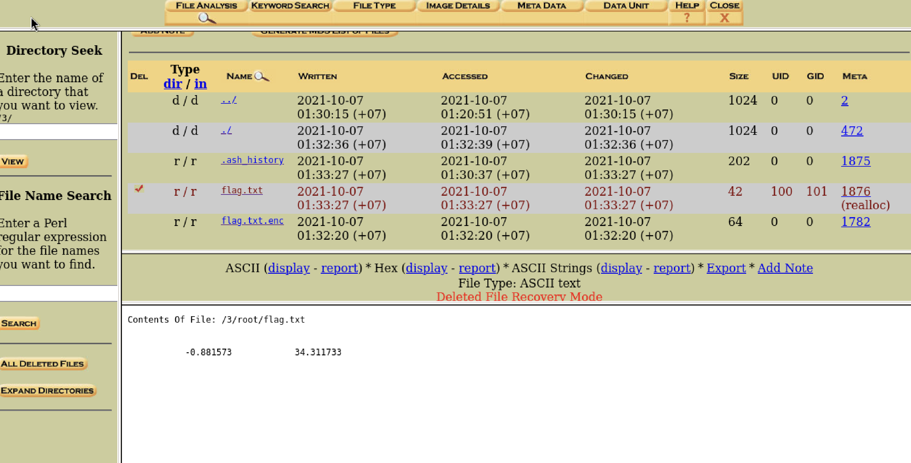

# Operation Orchid
Author: Tai Ngo

## Description

Author: LT 'syreal' Jones

Download this disk image and find the flag. Note: if you are using the webshell, download and extract the disk image into /tmp not your home directory.

## Writeups

With this challenge, I simply use `autopsy` and discover the image, I discovered the `/root` in the last partition.

The file `flag.txt` is deleted, and the flag.txt.enc is the encrypted file using openssl. Fortunately, I got the history and get the command of the encrypting process.

I exported the cipher text and decrypt it again with this command:

`openssl aes256 -salt -in vol4-3.root.flag.txt.enc  -out flag.txt -k unbreakablepassword1234567 -d`

FLAG: picoCTF{h4un71ng_p457_1d02081e}