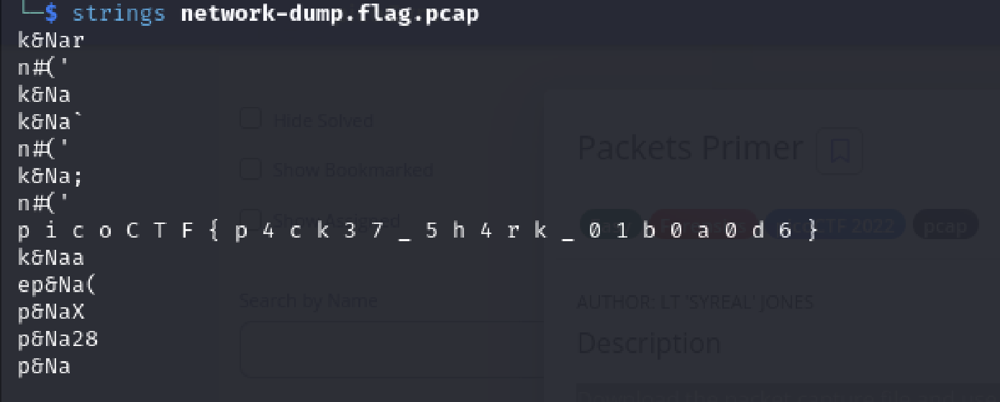
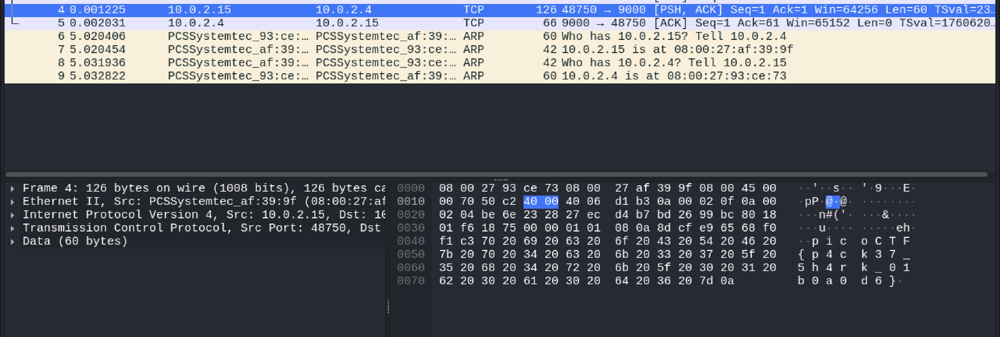

# Packets Primer
Author: Ngo Van Tai

## Description
Download the packet capture file and use packet analysis software to find the flag.

## Writeups
The challenge provides a .pcap file, there are two ways to solve this problem

1. using `strings` to get the flag

we can copy the flag and go to `sublime` text editor app, use `find` feature to find the empty space ` ` -> select `Find All` then remove it, we got the flag without reduntant spaces.

2. Use `wireshark` to read the `.pcap` file
