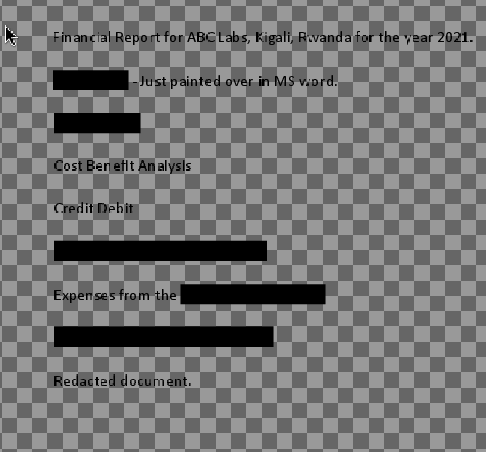

# Redaction gone wrong
Type: Foren

Author: Van Tai

## Description
Now you DON’T see me. This report has some critical data in it, some of which have been redacted correctly, while some were not. Can you find an important key that was not redacted properly?

## Write-ups
The keywords is redacted, the challenge gives me the pdf file with the black box hide the content beside it.

At first time, I used the app `ImageMagick` to read this `pdf` file, and I can not highlight the black box, I use the `firefox` to read this pdf file and I can highlight the text under the cover now.

I copied and pasted it in the another place, I got the flag

flag: picoCTF{C4n_Y0u_S33_m3_fully}
