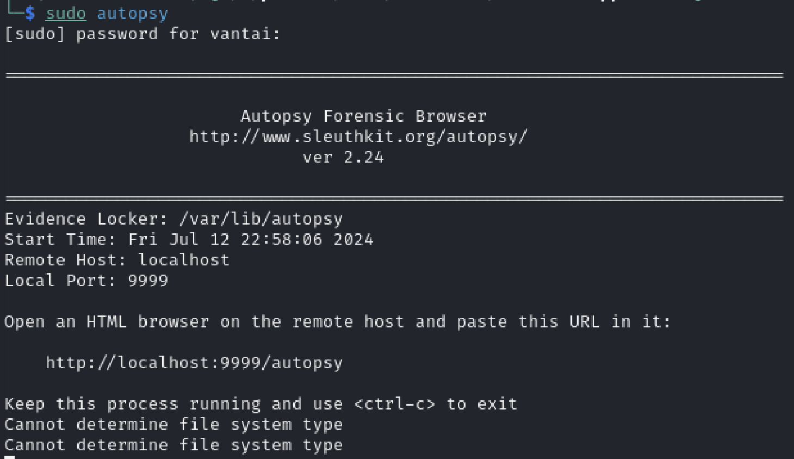
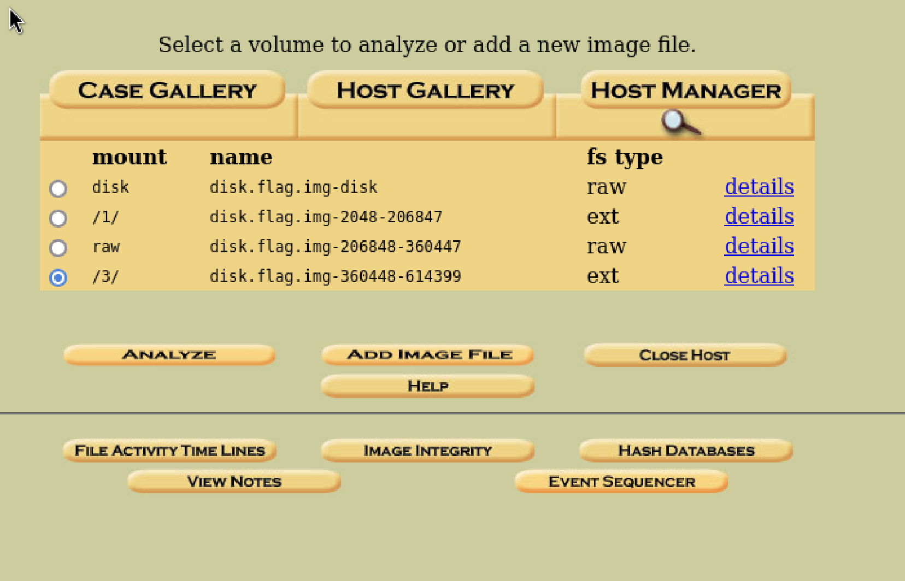
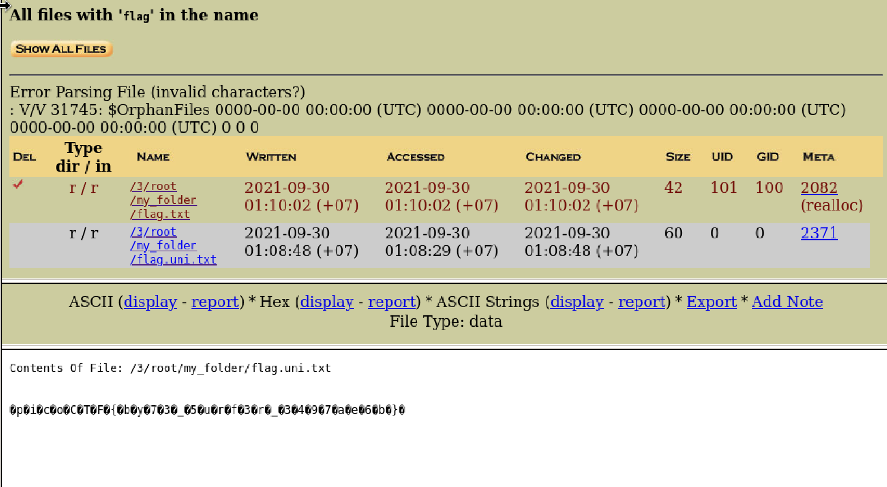

# {{Sleuthkit Apprentice}}
- Created Date: date: 2024-Jul-12 Time: 23:13
- Source: 
# Main idea
The download file is a gzip file, I unzip it with `gunzip`, then I can extract a .img file
I use `autopsy` to discover this disk.

For some reasons, I cannot run `autopsy` normally, I must use `sudo autopsy`
Then I access the link `http://localhost:9999/autopsy`
Create a new case and analyze the disk image

I went to the /3/ mount, clicked on the `analyze` -> `file analysis`
for the file name search, I typed `flag`

This is the results and I got the flag, there are few weird characters in our flag, but I use the text editor `Sublime Text` to remove these 
and submitted the flag

FLAG: picoCTF{by73_5urf3r_3497ae6b}    
# Related

