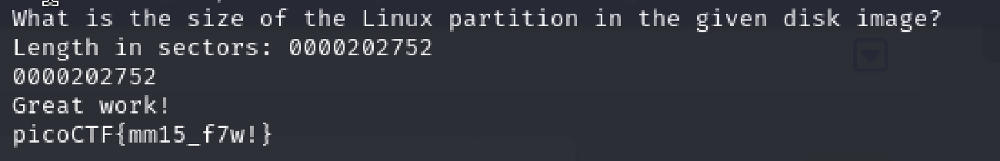
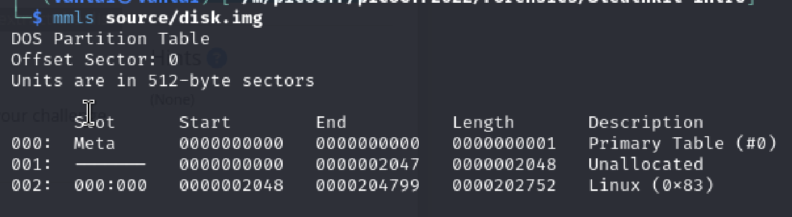

# Sleuthkit Intro
Author: Tai Ngo

## Description
Author: LT 'syreal' Jones

Download the disk image and use mmls on it to find the size of the Linux partition. Connect to the remote checker service to check your answer and get the flag.

Note: if you are using the webshell, download and extract the disk image into /tmp not your home directory. 

## Writeups

The challenge ask us to connect to the server and answer the question to get the flag

The question is about the length of the Linux  partition in the given disk image.

This answer is easy to get from the provided img by using `mmls` to see the things in this img
