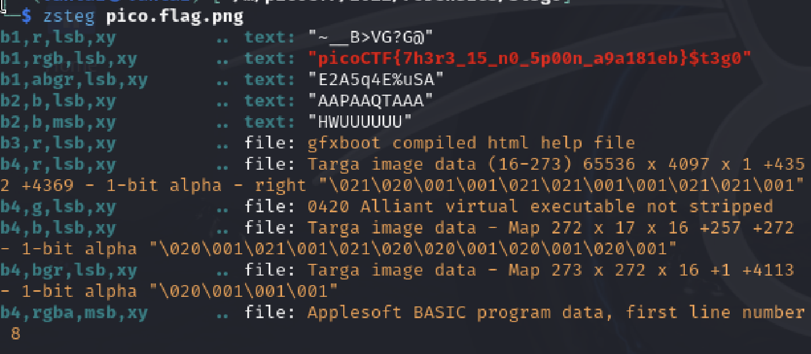

# SOLUTION

This is a easy quesiton, can be done quickly,use the `zsteg` to get the flag. `zsteg` is used for find some hidden data in the PNG or BMP files

FLAG: picoCTF{7h3r3_15_n0_5p00n_a9a181eb}

