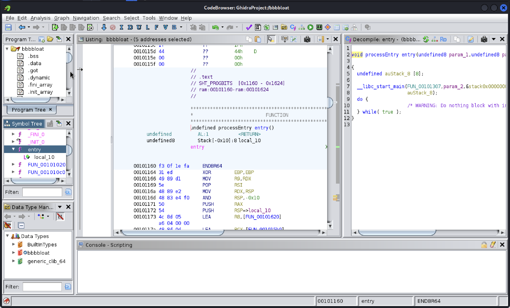
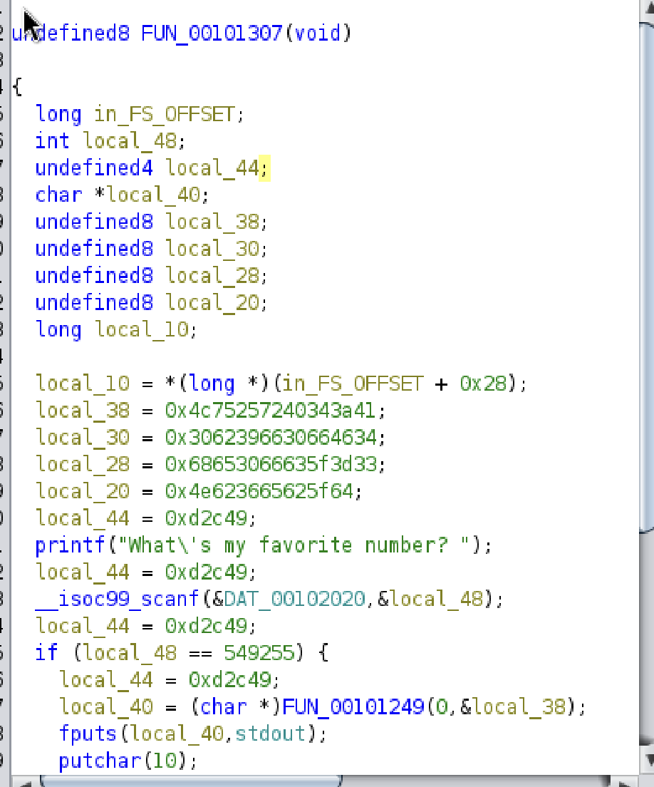

Src: https://play.picoctf.org/practice/challenge/255?originalEvent=70&page=1&search=bblo
# Solution
First this is a executable file, I grant the permission to execute the code. 

`What's my favorite number?: `

then our mission is to reverse the code using Ghidra. When open the `Ghidra`, try to find the `entry` fucntion first, since from that we can find the `main` function.

we can take a look at `FUN_00101307`, that's may be a `main` function

when I go to that, I read the line like `What's my favorite number: `, it looks like our code when execute it. Then there's a `if function` below, we can copy that and we got the flag. 
(!NOTE: The image shows the decimal number, but at first, the code show `hex number`, we use the right click and the `Ghidra` will convert it into `Decimal` for us)

