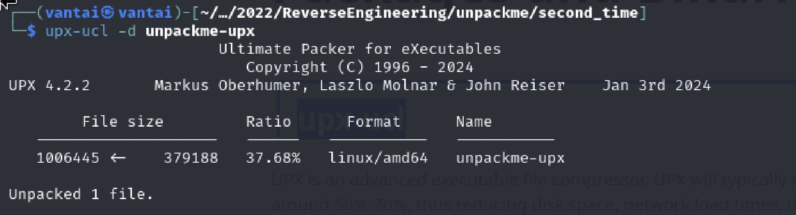
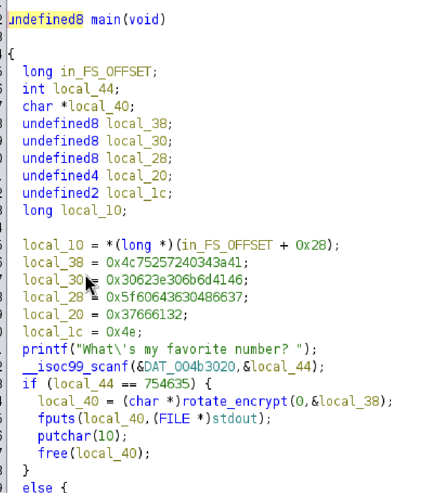
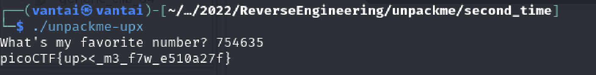

SRC: https://play.picoctf.org/practice/challenge/313?originalEvent=70&page=1&search=
# Solution

When we `file` the given file, we can see that, this is a executable file and it is a upx

```bash
file unpackme-upx 
unpackme-upx: ELF 64-bit LSB executable, x86-64, version 1 (GNU/Linux), statically linked, no section header
```
I tried to use Ghidra to reverse the code, but it don't work well. 
After searching what is the UPX file, I know that it is used to pack the file inside that file. 
I use this [tool](https://www.kali.org/tools/upx-ucl/) to decompress the file.



After that, I can `file` it again
```bash
file unpackme-upx 
unpackme-upx: ELF 64-bit LSB executable, x86-64, version 1 (GNU/Linux), statically linked, BuildID[sha1]=5e4be04529afcdb8fa8855e3138c3f51047fa123, for GNU/Linux 3.2.0, not stripped
```

When I use `Ghidra` again, I can easily access the `main()` and got the number that we need


ANSWER:



FLAG: picoCTF{up><_m3_f7w_e510a27f}