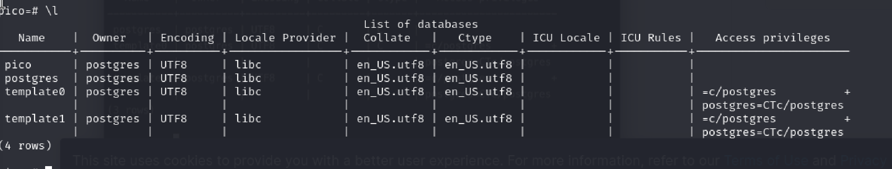
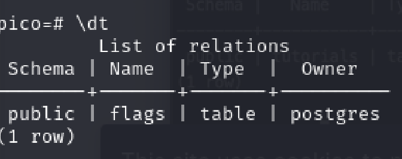
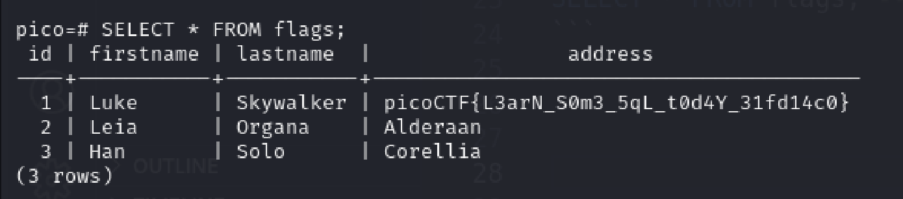

# SQL Direct
Author: Tai

## Description
Author: Mubarak Mikail / LT 'syreal' Jones

Connect to this PostgreSQL server and find the flag! psql -h saturn.picoctf.net -p 53586 -U postgres pico Password is postgres

## Writeups
We need to use some [psql commands](https://hasura.io/blog/top-psql-commands-and-flags-you-need-to-know-postgresql) to solve this challenge.

Firstly, I list all the database using `\l`



Connect to the pico database by `\c pico`

Then I use `\dt` to see all the tables in this database


I saw the flag, and I use query to extract all the data in the table
```SQL
SELECT * FROM flags; -- REMEMBER TO PUT THE ';' AT THE END
```



FLAG: picoCTF{L3arN_S0m3_5qL_t0d4Y_31fd14c0}


