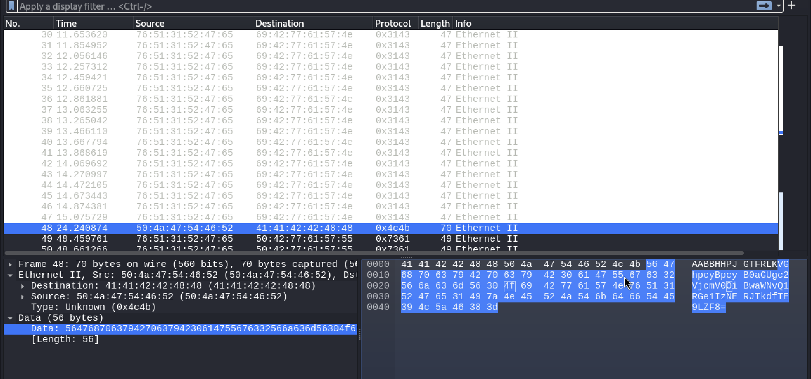

# FindAndOpen
Author: Tai Ngo

## Description
Author: Mubarak Mikail

Someone might have hidden the password in the trace file. Find the key to unlock this file. This tracefile might be good to analyze.

## Writeups

This challenge provides us with one file `.pcap` and a `.zip`. I tried to `unzip` the `flag.zip` but it asks for password.

I use `wrireshark` to read the `.pcap` file, the content of this file is not that much. I discovered around and see there's a signature of the base64 encoding. 

The data has the `=` in the end. I tried to decoded it using online tool and get the unfinished flag

`This is the secret: picoCTF{R34DING_LOKd_`

I used it as the password of the zip file, and it's success. Password: picoCTF{R34DING_LOKd_

FLAG: picoCTF{R34DING_LOKd_fil56_succ3ss_5ed3a878}
