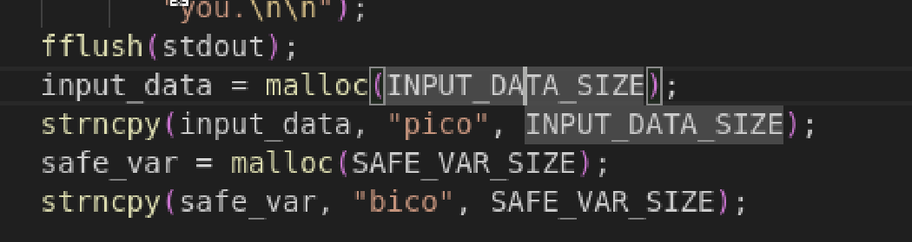
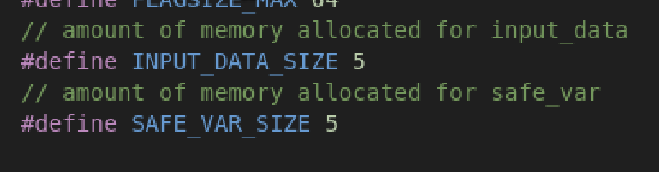
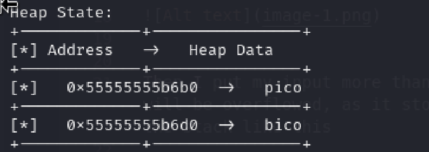

# heap 0
Author: Tai Ngo

## Description
Author: Abrxs, pr1or1tyQ

Are overflows just a stack concern? Download the binary here. Download the source here.

Additional details will be available after launching your challenge instance.

## Writeups

In this challenge, we see that the program defines that the `input_data` and `safe_var` is only 5 bytes

Then I put my input more than 5 bytes, then the data will be overflowed, as it stores on top each other in the stack like this 

Our goal is just make the `bico` is not `bico` anymore by make it overflow

FLAG: picoCTF{my_first_heap_overflow_749119de}