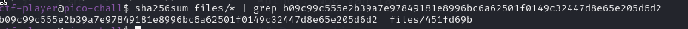
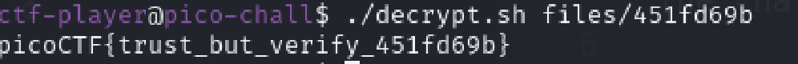

# Verify
Author: Ngo Van Tai

## Description
People keep trying to trick my players with imitation flags. I want to make sure they get the real thing! I'm going to provide the SHA-256 hash and a decrypt script to help you know that my flags are legitimate. You can download the challenge files here:

Additional details will be available after launching your challenge instance.

## Writeups
We can connect with the host through `ssh`, after searching around, I found that there's a `checksum.txt`, read the hints I know that we need to use `sha256checksum` to solve this challenge. The `checksum` is using for check the files we want to download is that file or it is changed. This use to ensure the integrity of the file.

First I `cat` the `checksum.txt` to see the content, I see it has a string.

I use `sha256sum files/* | grep ...` the `...` is the string in the `checksum.txt` file. It will perform checksum for the whole files in the folder `files` then find the value that match the `checksum.txt`, I recieved this results

Then I knew that, the file 451fd69b is the file that we need to use for the `decrypt.sh`

I got the flag
FLAG: picoCTF{trust_but_verify_451fd69b}
