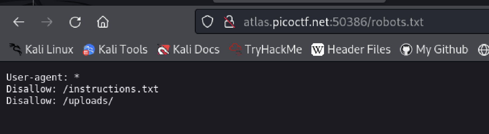
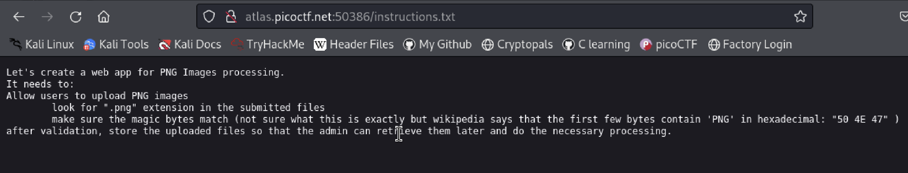
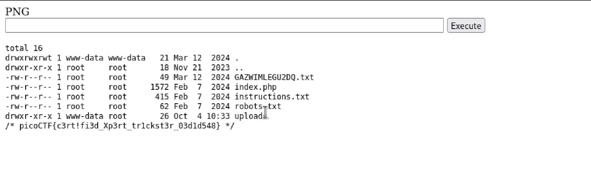

# Trickster
Author: Tai Ngo

## Description
Author: Junias Bonou

I found a web app that can help process images: PNG images only! Try it here!

## Writeups

Thanks to this [video](https://www.youtube.com/watch?v=bHo4doTPKkE), which help me solve this challenge.

Firstly, I accessed the `robots.txt` to find some useful information.

I found `instructions.txt` and `upload`. It would be the instruction for the web and the file we upload will be stored in the `uploads`. With this instruction file, I know that we can upload another file type with PNG. 

I used this [code](https://gist.github.com/joswr1ght/22f40787de19d80d110b37fb79ac3985) to create the webshell with php. But I add the `PNG` in the first line, to have some first few bytes contain `PNG`. Then, I accessed my uploaded file through `uploads/test.png.php`

Then I can get the flag with this command `cd .. ; ls -la ; cat GAZWIMLEGU2DQ.txt`

Flag: picoCTF{c3rt!fi3d_Xp3rt_tr1ckst3r_03d1d548}