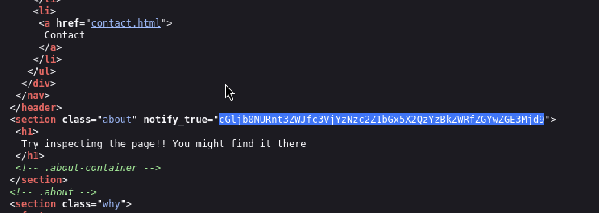

# WebDecode
Author: Tai Ngo

## Description

Author: Nana Ama Atombo-Sackey

Do you know how to use the web inspector? Start searching here to find the flag

## Writeups

I used the inspector to find three pages, and I found the supicious code in the `about` page

This is base64 encoder, I used the decoder online to decrypt it.

Flag: picoCTF{web_succ3ssfully_d3c0ded_df0da727}